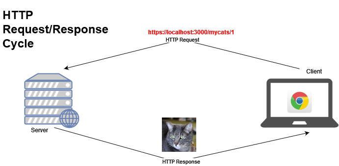
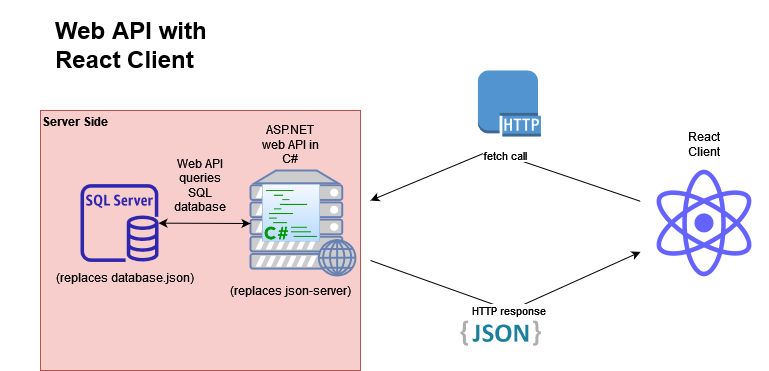

# Server-Side Development with C#/.NET
You made it! Welcome to the continuation of the web development course. You may have been hearing this term "server side," which sounds vaguely ominous, but have no fear! The difference between client side and server side is a little confusing at first, but once we define some terms, it gets easier. 

## What's server-side development?
Most of the code you've written up until now has been written to run in the browser. When you are running your React apps, and type in `localhost:3000` in a browser url bar, your browser asks for and receives a big bundle of Javascript, and then runs that code _in the browser_ using the browser's Javascript runtime. For the next few months, most of the code (and all of the C# code) that you write will not run in the browser, but will run in the .NET runtime on a _server_ rather than a browser. So what's server-side development? It's nothing more than writing code to run outside of the browser on a server somewhere. 

## What's a server?
Fair question. For web development, server has two meanings which are relevant to you.
1. The hardware on which a server-side application runs. This could be a physical server in a data center, or a virtual machine (that is also running on a physical server somewhere), or for most developers when they are building and testing their applications locally, the developer's own computer (Hey, this means you too! You're a software developer!) So as far as this definition goes for you, your computer is the physical server.
1. *Server* can also mean a piece of software that runs on a physical server and listens for network requests and then decides what to do with the request. If everything goes well, this usually means providing some kind of response. 

 You have already been using and interacting with a number of web servers in the client-side part of the course:
 1. You might not be surprised to find out that `serve` is an application that runs a web server. When it starts, it will look for content in whatever directory you supplied when you start the application.  
 1. When you run `npm start`, the webpack development server listens for requests to `localhost:3000` and returns all of the javascript needed to run your React app in the browser. 
 1. `json-server` is a program that listens for network requests and tries to map the url of the network request to data in a provided json file. We are going to talk a lot more about this idea of mapping routes (urls) to data resources later in the course. 

### The Request/Response Cycle
 What do all of these servers have in common? They all:
 1. are listening for network requests (mostly HTTP requests for our purposes)
 1. decide what to do with the request based on their own code and the data provided in the request. 
 1. return some kind of response. 

 What kind of responses? I'm so glad you asked. All kinds! Javascript code, JSON, HTML code, PDFs of phone bills, pictures of cats -  whatever you want. They can also respond with error messages, or ruder responses like "Unauthorized", "Forbidden", or the dreaded `500: Internal Server Error` (this usually means we messed up our code somehow.)

 

## Web Apps with C#/.NET
Wait a minute, if `json-server` worked on the front end, can't we just use that forever? Sigh. I wish we could. But no, even its documentation says that it is only for mocking server-side apps. Once our applications are deployed and have a lot of data, or a lot of users, we will need more robust applications for our APIs. 

### C#
C#/.NET (along with a SQL Server database) is a very popular language and platform with a rich toolchain and development environment for building those robust web applications. Building our own APIs (instead of using `json-server`'s automatically generated one) also lets us create custom resources tailor-made for our application's needs. There are a number of things about C# that are very different from JS, including:
1. a strong type system (variables are declared as being strings or integers and many other types, and their type stays the same for their lifetime, among other things.)
1. the code is compiled first before it is run. Compilation is the process of turning code into another type of code before running it, which has a number of benefits that we don't need to enumerate here.  

>You will find that despite the many differences, much of the syntax that you learned for JS will transfer directly to C#. 

### .NET Runtime
The .NET runtime will actually run our compiled C# code. A runtime is just another program that takes our code as input and turns it into instructions that our computers' processors can understand. Just like with servers, you've already been interacting with another runtime: the Javascript runtime! When we say that our React apps run "in the browser," we really mean the Javascript engine that comes with the browser. Instead of running in a browser, the .NET Runtime will run your C# code in a separate process on your computer (or somewhere else if you app is deployed!) The term .NET is bigger than just the runtime, and includes many other tools and libraries under the banner of .NET. Older versions of .NET were called .NET Framework (Windows only) and .NET Core (the precursor to the current .NET).

>It's important that when you're looking for documentation or tutorials on the web, you look for documentation for .NET 5 and up. It can be difficult to search for ".NET" by itself, because that will include older versions in your search, so if you're having a hard time finding a modern enough example of something you're trying to do, adding "Core" to your search will probably help you eliminate the .NET Framework examples for web development that may contain code that simply won't work in your apps. Obviously, if you can find something for the newest versions of .NET, that's preferable.  

## What this course is not
It is important to point out that despite the name, this course is _not_ a course in C#. Yes, we will be learning a lot of C# and using .NET tools and libraries to build our apps, but that is not the primary goal of the course. This course is primarily a _web development_ course that happens to use C# for the backend language. C#/.NET is a much wider and deeper topic than we can completely cover in this course. For deeper dives into the language and platform, see some links below. 

OK, got it all? I heard someone say yes, so let's get started. Work on the reflections below, and then head to the [Table of Contents](./TABLE_OF_CONTENTS.md). 
___

## ✍️ Reflections
1. Take a look at some of the architecture diagrams in this chapter, and see if you can draw one for your own front-end capstone (you will likely write a lot of architecture diagrams in your career as a developer.) What are the different pieces, and how do they connect to each other?
1. Share your diagram with a colleague and see how they are the same/different, and check in with yourself about what parts of the app architecture are still murky or mysterious. 
1. Write those down to bring up later with your group and instructor!

> Whenever you see "Additional Material" or "Additional Material and Exercises" at the end of a chapter you do not need to work on any of it before moving on to the next chapter, but if you have time for it on lab days or after class in the same week, it can be very helpful and is more than just footnotes for the chapters. Obviously you can come back to it later in the course, but that gets less likely the further away from it you get.
## 🔍 Additional Material
1. [Microsoft C# Tutorials](https://learn.microsoft.com/en-us/dotnet/csharp/tour-of-csharp/tutorials/)
1. [What is .NET](https://dotnet.microsoft.com/en-us/learn/dotnet/what-is-dotnet)
1. [The Difference between C# and .NET through the lens of JS](https://learn.nashvillesoftwareschool.com/blog/2091/07/18/the-difference-between-c-and-.net-through-the-lens-of-javascript)